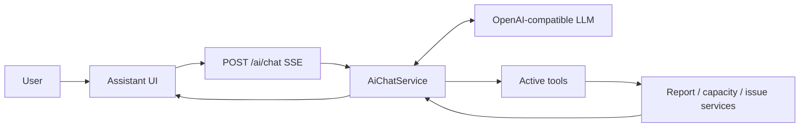
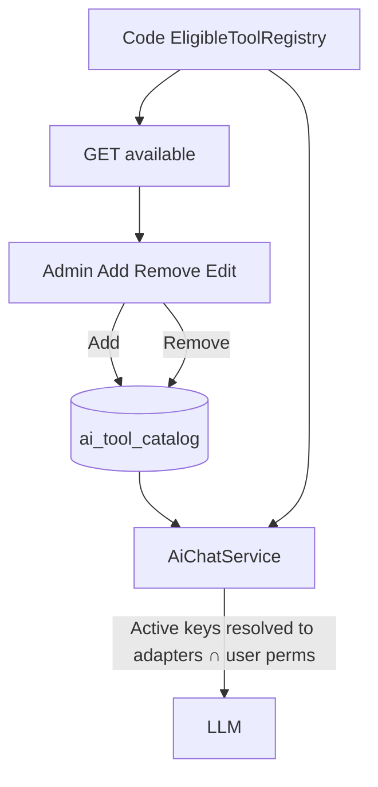
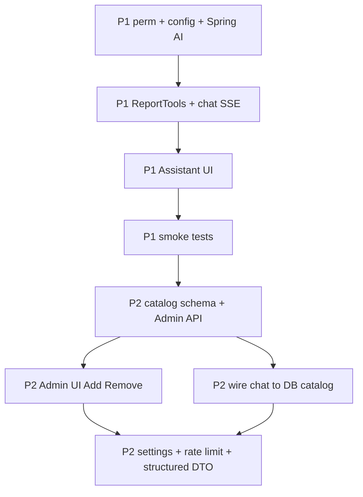

# Agentic AI — Phase 1 & Phase 2 Implementation Plan

## Goal

In-app Assistant that answers natural-language questions about **reports and statistics** by calling existing backend services as tools, under the **logged-in user’s JWT + RBAC + org scope**. Admin later controls which APIs the agent may use.



**Stack:** Spring Boot 3.2.5 / Java 21 + Spring AI (OpenAI-compatible) + React Assistant page. No Spring AI in the repo today — add it in Phase 1.

**Locked decisions:**
- Agent runs in backend (not browser-only LLM).
- Tools call **service beans** (same `SecurityContext`), not arbitrary URLs.
- Permission: **`AI_ASSISTANT_VIEW`** (dedicated; not only `REPORTS_VIEW`).
- MVP tools are **read-only**.
- Admin never pastes free-form URLs/SQL; Add = pick from code **eligible pool**.
- Phase 1 seeds a default Active tool set so chat works before Admin UI.
- Provider: OpenAI-compatible via `dfnpm.ai.*` (swap base-url for Azure/gateway/local later).
- AI is an **additive, optional module** — existing Dashboard/reports/RBAC stay the source of truth and keep working with AI off or removed.
- **LLM usage is paid only if you point at a paid API**; local/free OpenAI-compatible endpoints are supported by changing `base-url` + `model` (no code fork).

## Cost and free LLMs

### Does implementing the Agent cost money?

| Cost type | When |
|-----------|------|
| **Engineering** | Your time to build/deploy (always) |
| **LLM inference** | Only when Assistant is **enabled** and a user sends a chat that calls the model |
| **Turned off** | `dfnpm.ai.enabled=false` → **no LLM calls → $0 inference** |
| **Idle** | No one chatting → no calls → $0 inference |

You are **not** charged just for shipping the module. Cost scales with questions × tokens (prompt + tool JSON + answer). Multi-tool questions cost more than a short reply.

Rough drivers: model price, how much report JSON tools return, max tool rounds, how many users chat.

### Can we use free LLMs?

**Yes.** The plan uses an **OpenAI-compatible** client, so you can point `dfnpm.ai.base-url` + `model` (+ optional key) at:

| Option | Cost | Notes |
|--------|------|--------|
| **Ollama / LM Studio (local)** | Free (your hardware) | Best for dev/demo; data stays on machine; quality/speed depend on GPU/RAM |
| **Groq / Google AI Studio / other free tiers** | Free or free quota | Often OpenAI-compatible or thin adapter; check rate limits and data policy |
| **OpenAI / Azure OpenAI** | Paid per token | Higher quality/reliability for production |
| **Self-hosted vLLM / OpenWebUI gateway** | Infra cost only | Good middle ground for private data |

**Recommended approach:**
- **Local/dev:** Ollama (e.g. `http://localhost:11434/v1`, model like `llama3.1`) — `$0` API.
- **Production:** choose paid API **or** private/self-hosted if data residency matters; keep the same code path.

Admin **Select LLM** (Phase 2 AI Settings) switches among preconfigured profiles (e.g. `local-ollama`, `openai-prod`) without rewriting tools.

**Caveats for “free” models:** weaker tool-calling than GPT-4-class models; may need simpler prompts/fewer tools; free cloud tiers often log prompts — local Ollama avoids that.

### Adding another LLM later

No tool/chat code change if the provider is **OpenAI-compatible**:

1. Add a profile under `dfnpm.ai.profiles` in YAML (label, base-url, model, api-key from env).
2. Redeploy or reload config so the backend lists it.
3. Admin → **AI Settings → Select LLM** → pick the new profile (saves `ai.model_profile`).
4. Next chats use that LLM.

If the provider is **not** OpenAI-compatible: add a small Spring AI client adapter, still expose it as a profile for Admin. Tools and API catalog stay the same. Never store new provider keys in Admin UI / DB plaintext.

---

## Module isolation — impact on the rest of the app

### Is it a separate module?

**Yes, logically.** Implementation is additive and contained:

| Layer | AI-owned | Shared (read-only use) |
|-------|----------|-------------------------|
| Backend | `com.nexuspm.ai.*`, `/api/v1/ai/**`, `/admin/ai-tools` | Calls existing `ReportService` / capacity / issues — **does not change** those services’ contracts for the UI |
| Frontend | `/assistant`, Assistant components, AI Admin tabs | Nav link + permission only; Dashboard and Admin tabs unchanged |
| DB | `AI_ASSISTANT_VIEW`, optional `ai_tool_catalog`, `ai.*` settings | No change to projects/issues/allocations schemas for core flows |
| Deps | Spring AI starter | Only on the backend classpath; unused when AI disabled |

AI **does not replace** Dashboard or report APIs. Those keep working exactly as today.

### Turn off (`dfnpm.ai.enabled=false` or Admin soft off)

| What happens | Effect |
|--------------|--------|
| Chat API | Rejects with 503 / “unavailable” |
| LLM / Spring AI calls | Not invoked (no cost, no outbound) |
| Assistant nav / page | Hidden or shows unavailable |
| Admin AI tabs | Can remain visible for config, or hide when hard-off |
| Dashboard, backlog, users, reports | **Unaffected** |
| Permissions / seed rows | Harmless leftovers |

Turning off is the normal ops kill switch. No data migration required.

### Remove the module later (stronger)

If you delete AI code + dependency + optional tables:

| Remove | App impact |
|--------|------------|
| `com.nexuspm.ai`, Assistant UI, Admin AI tabs, Spring AI from `pom.xml` | App builds and runs as before AI existed |
| Drop `ai_tool_catalog` / unused `ai.*` settings | Optional cleanup; zero impact on core tables |
| Leave `AI_ASSISTANT_VIEW` in DB | Harmless orphan permission, or delete via SQL |
| Tool wrappers | Only called from AI; removing them does not break `ReportService` callers |

**Caveat:** AI is not a separate deployable JAR in Phase 1–2 (same Spring Boot app / same frontend bundle). Isolation is by **package + feature flag**, not a microservice. “Remove module” = remove those packages/deps/routes from the monorepo and redeploy — not uninstall a plugin at runtime.

**Do not** put AI logic inside existing report controllers in a way that Dashboard requires Spring AI. Controllers stay as they are; AI only **calls** services.

---

## Phase 1 — Chat MVP (seeded tools)

**Outcome:** Users with `AI_ASSISTANT_VIEW` open `/assistant`, ask questions, get streamed answers backed by dashboard/capacity/issue tools. No Admin catalog UI yet.

### 1.1 Permissions and seed

| Place | Change |
|-------|--------|
| [Permissions.java](nexus-pm-backend/src/main/java/com/nexuspm/shared/security/Permissions.java) | Add `AI_ASSISTANT_VIEW = "AI_ASSISTANT_VIEW"` |
| [permissions.ts](nexus-pm-frontend/src/utils/permissions.ts) | Add `AI_ASSISTANT_VIEW` to `P` |
| [seed.sql](sql/seed.sql) | Insert permission row + grant to Super Admin, Admin, CXO, VP, Manager (same spirit as `REPORTS_VIEW`); Employees optional (default: **no**) |
| Alter for existing DBs | Small `sql/alter-ai-assistant-permission.sql` (INSERT permission + role_permission) |

Gate chat with `@PreAuthorize("@perm.can('AI_ASSISTANT_VIEW')")`. Hide nav unless `can(P.AI_ASSISTANT_VIEW)`.

### 1.2 Config and dependency

**pom.xml:** add Spring AI OpenAI starter compatible with Boot 3.2 (pin a known-good BOM/version).

**[DfnPmProperties.java](nexus-pm-backend/src/main/java/com/nexuspm/shared/config/DfnPmProperties.java):** nested `Ai` properties:

- `enabled` (boolean)
- `api-key`, `base-url`, `model`, `max-tokens`
- `max-tool-rounds` (default 4)
- `system-prompt` (optional override string; default in code)

**YAML:** `dfnpm.ai:` in [application.yml](nexus-pm-backend/src/main/resources/application.yml); secrets in [application-local.yml](nexus-pm-backend/src/main/resources/application-local.yml) / env. Document in `application-local.yml.example`.

When `enabled=false` or missing key: chat API returns clear 503; UI shows “Assistant unavailable”.

### 1.3 Backend package `com.nexuspm.ai`

| Class | Responsibility |
|-------|----------------|
| `AiChatController` | `POST /api/v1/ai/chat` → SSE (`text/event-stream`); body `{ "message": "..." }`; optional `conversationId` later |
| `AiChatService` | Build system prompt (role codes + “never invent numbers; only use tools”); run agent with Active tools ∩ user permissions; stream tokens/events |
| `ReportTools` (eligible pool) | `@Tool` methods wrapping existing services |
| `AiToolCatalog` (Phase 1 stub) | In-memory/default list of seeded Active tool keys; Phase 2 replaces with DB |
| `AiProperties` / config beans | Wire ChatClient / OpenAI |

**SSE event shapes (MVP):**
- `token` — incremental text
- `tool_start` / `tool_end` — optional UX (“Fetching capacity…”)
- `done` — final message + optional structured payload
- `error` — user-safe error

**Security:** JWT required; no elevated service account; tools inherit `SecurityContext`.

### 1.4 Phase 1 tool set (eligible + seeded Active)

Prefer service calls over HTTP self-call:

| Tool key | Wraps | Extra permission |
|----------|-------|------------------|
| `dashboard.summary` | `ReportService.getDashboardSummary()` | (base AI + typically reports data already scoped) |
| `dashboard.overview` | `ReportService.getDashboardOverview()` | same |
| `capacity.utilisation` | `CapacityUtilisationService.getDashboard(weeks)` | also require `ALLOCATIONS_VIEW` to register |
| `issues.statusCounts` | existing status-counts on `IssueService` / controller path | issue view as today |
| `issues.crMatrix` | CR status matrix service method | as today |

Omit write endpoints (e.g. EM additional-resources PUT). EM capacity plan tool optional if `PMO_VIEW` present — include if low effort.

At chat time: only tools in **seeded Active** ∩ user’s permissions are registered.

### 1.5 Frontend Phase 1

| Piece | Detail |
|-------|--------|
| Route | `/assistant` in [router/index.tsx](nexus-pm-frontend/src/router/index.tsx) + `PermissionRoute` for `AI_ASSISTANT_VIEW` |
| Nav | [AppShell.tsx](nexus-pm-frontend/src/components/layout/AppShell.tsx) top-level NavLink when `can(P.AI_ASSISTANT_VIEW)` |
| Page | `AssistantPage.tsx` — message list, input, send, streaming area |
| API | `assistant.api.ts` — `fetch` SSE with `Authorization: Bearer` (axios is not ideal for long streams; reuse token from existing auth store; handle 401 like axios refresh if practical) |
| UX | Role-based **starter prompt chips**; disclaimer line; empty state when AI disabled; error banner on stream failure |
| Render | Markdown for narrative; simple tables if JSON metrics present (full structured DTO in Phase 2) |

### 1.6 Phase 1 hardening (minimal)

- Kill switch: `dfnpm.ai.enabled`
- Audit one line per chat: `auditLogService.log(..., "AI_CHAT", "AI", null, truncatedQuestion, ip)` via [AuditLogService](nexus-pm-backend/src/main/java/com/nexuspm/shared/audit/AuditLogService.java)
- Cap tool rounds via config
- No DB schema required except permission seed/alter

### 1.7 Phase 1 acceptance checks

- Manager with AI permission: “Who is over-allocated next 4 weeks?” → capacity tool → sensible answer.
- User without `ALLOCATIONS_VIEW`: capacity tool not offered; agent explains limit or uses other tools.
- User without `AI_ASSISTANT_VIEW`: no nav; API 403.
- `enabled=false`: clear unavailable UI.
- Proxy: document SSE timeout note for deploy (nginx/ALB).

### 1.8 Phase 1 files (checklist)

**Backend:** `pom.xml`, `DfnPmProperties`, `application.yml` (+ example local), `Permissions.java`, `com.nexuspm.ai.*`, reuse `ReportService`, `CapacityUtilisationService`, issue report methods.

**Frontend:** `permissions.ts`, `AppShell.tsx`, `router`, `pages/Assistant/AssistantPage.tsx`, `api/assistant.api.ts`.

**SQL:** `seed.sql` + `alter-ai-assistant-permission.sql`.

---

## Phase 2 — Admin catalog, settings, stronger contract

**Outcome:** Admins Add/Remove which eligible APIs the agent uses; tune AI settings; answers use a structured DTO; rate limits + richer audit; better trust UX.

### 2.1 Database

**Table `ai_tool_catalog`** (Active tools only):

- `id` UUID PK  
- `tool_key` VARCHAR unique (e.g. `capacity.utilisation`)  
- `display_name` VARCHAR  
- `description` TEXT (LLM-facing; editable)  
- `required_permission` VARCHAR nullable (override; else pool default)  
- `sort_order` INT  
- `created_at` / `updated_at` / `updated_by`  

**Settings:** reuse [system_settings](nexus-pm-backend/src/main/java/com/nexuspm/admin/entity/SystemSetting.java) keys:

- `ai.enabled` (mirror or override yaml; yaml remains hard off if key missing in prod policy — prefer: yaml master kill + settings soft toggles when yaml enabled)
- `ai.allowed_roles` (comma role codes) or rely on permission grants only  
- `ai.system_instructions`  
- `ai.max_tools_per_question`  
- `ai.rate_limit_per_hour`  
- `ai.model_profile` — **Admin-selected LLM profile key** (e.g. `local-ollama`, `openai-prod`)

SQL: `sql/alter-ai-tool-catalog.sql` + seed default Active rows matching Phase 1 tools. Update [build.sql](sql/build.sql) for greenfield installs.

### 2.2 Eligible pool vs Active (runtime)



- **EligibleToolRegistry** (code): tool_key → adapter bean, default description, default permission, linked API path (display only).
- **Active:** rows in `ai_tool_catalog`.
- Chat loads Active; resolves adapters from registry; skips unknown keys; intersects permissions.

### 2.3 Admin APIs

Under `/api/v1/admin/ai-tools` (gate `ADMIN_VIEW` or `AI_TOOLS_UPDATE` if seeded):

| Method | Path | Behavior |
|--------|------|----------|
| GET | `/available` | Eligible pool minus already Active |
| GET | `/active` | Catalog rows |
| POST | `/active` | Body `{ toolKey, displayName?, description? }` — Add |
| PUT | `/active/{id}` | Edit name/description/permission/sort |
| DELETE | `/active/{id}` | Remove |

AI settings: extend existing `/admin/settings` list/update, or dedicated `GET/PUT /admin/ai-settings` that maps to `ai.*` keys.

### 2.4 Admin UI

Extend [AdminPage.tsx](nexus-pm-frontend/src/pages/Admin/AdminPage.tsx):

1. Tab **AI Tools** — two panels: Available | Active; Add / Remove / Edit description.  
2. Tab **AI Settings** — includes an explicit **Select LLM** control:
   - **Dropdown: Active LLM** — list of profiles from `GET /admin/ai-settings/profiles` (from `dfnpm.ai.profiles` in YAML)
   - Saving writes `ai.model_profile` (e.g. switch Local Ollama ↔ OpenAI without redeploy)
   - Under the dropdown, show read-only: display name, model id, base-url host (never show API key)
   - Also on this tab: Assistant on/off, system instructions, max tools/turn, rate limit
   - Profiles themselves (URL, key, model id) are defined by ops in server config/secrets — Admin only **selects** among them

Example YAML profiles Admin can choose from:

```yaml
dfnpm:
  ai:
    profiles:
      local-ollama:
        label: Local Ollama (free)
        base-url: http://localhost:11434/v1
        model: llama3.1
        api-key: ollama
      openai-prod:
        label: OpenAI GPT-4o mini
        base-url: https://api.openai.com/v1
        model: gpt-4o-mini
        api-key: ${OPENAI_API_KEY}
```

Follow existing Admin tab + `tabVisible` + `can(P.ADMIN_VIEW)` pattern. New components under `pages/Admin/` e.g. `AiToolsSection.tsx`, `AiSettingsSection.tsx`; API in `admin.api.ts` or `aiAdmin.api.ts`.

### 2.5 AiChatService changes

- Replace Phase 1 seeded list with DB Active catalog (cache short TTL or invalidate on Admin write).
- Resolve chat client from **Admin-selected** `ai.model_profile` (fallback to default profile in YAML).
- Apply `ai.system_instructions` appended to base system prompt.
- Enforce `ai.max_tools_per_question` / `max-tool-rounds`.
- Enforce per-user rate limit (`ai.rate_limit_per_hour`) — in-memory or Redis if already used for auth rate limit.
- Respect soft `ai.enabled` when yaml enabled.
- Optional role allow-list if configured.

### 2.6 Structured answer contract

Agent (or post-process) fills:

```json
{
  "title": "...",
  "summary": "...",
  "metrics": [{ "label": "...", "value": "..." }],
  "tables": [{ "title": "...", "columns": [], "rows": [] }],
  "caveats": ["..."],
  "sources": [{ "toolKey": "capacity.utilisation", "label": "Capacity utilisation", "href": "/?..." }]
}
```

Frontend renders metrics/tables/caveats + disclaimer + deep links to Dashboard/report routes.

### 2.7 Hardening and trust UX

- Richer audit: question snippet, tool keys used, latency, success/fail (details JSON truncated).
- Rate-limit 429 with clear message.
- Empty Active catalog → “No data sources configured; contact Admin.”
- Disclaimer always visible on Assistant page.
- Starter prompts remain; optionally Admin-editable later (out of scope unless cheap).

### 2.8 Phase 2 acceptance checks

- Admin Removes `capacity.utilisation` → agent can no longer call it; Add restores it without redeploy.
- Edit description changes tool selection behavior for similar questions.
- Rate limit trips after N questions/hour.
- Structured answer shows table + caveat in UI.
- Employee without AI permission still blocked; Admin without AI still manages catalog via Admin perms.

### 2.9 Phase 2 files (checklist)

**SQL:** `ai_tool_catalog`, settings seeds, `build.sql` / alter scripts.

**Backend:** `AiToolCatalog` entity/repo/service, Admin controller endpoints, EligibleToolRegistry, AiChatService DB wiring, rate limiter, structured DTO, settings integration.

**Frontend:** Admin tabs + sections, assistant render for structured payload, optional deep links.

---

## Explicitly out of Phase 1–2

- Write/mutate tools (create issues, change allocations).
- Free-form URL or SQL tools.
- Multi-turn DB conversation history (session-only or client-held history OK in P1; full `ai_conversation` tables = Phase 3).
- Scheduled digests, token cost dashboards, per-role tool packs.
- Auto-discovery of all REST controllers.

---

## Suggested build order



---

## Design reminders (unchanged)

- Same data as Dashboard; agent = NL + multi-tool join, not a second warehouse.
- Hard RBAC in tools; prompt only soft guidance.
- New metrics needing new queries → new service → eligible pool entry → Admin Add.
- LLM host sees scoped tool JSON — choose provider with compliance in mind.
- Keep 10–20 golden questions for regression after prompt/tool changes.
